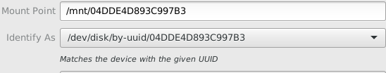
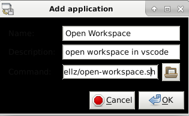

I dual boot Windows and Linux on my home computer. Windows is awesome to have for playing video games but Linux is great when I want to get in touch with my inner nerd. The way that I've had my projects setup from years ago is that I have a `projects` folder setup in Documents on my windows partition. This way, if I'm using Windows and using Visual Studio, I simply have the projects folder right there with me. If I'm using Linux, I simply mount my Windows partition and use a startup script to open my projects folder automatically.

1. Open `disks` utility in Linux and find the partition that you want to auto mount 


You can tell that the partition is Windows because the filesystem is NTFS. In fact, it is the biggest NTFS filesystem partition meaning that is where all of our files must be stored. 

2. Set the mount point to a familiar name



By default, the mount point of the partition will be some random UUID like above. We don't want this because the UUID may change (**NOTE**: It shouldn't, so why is it)

3. Create a workspace within VSCode

Open the project folder in VSCode that you'd like to be opened by default. In VSCode, go to `File -> Save As Workspace` to save your workspace with a `.code-workspace` extension. VSCode will use this file extension to automatically load your project folder.

4. Create a shell script to open the workspace with VSCode 

```bash
#!/bin/bash

code /home/<username>/desktop/projects-workspace.code-workspace
```

*`<username>` will be replaced with your username*

The above assumes that I've saved the workspace as `projects-workspace`. 

5. Make the shell script executable. 

```shell
chmod 744 open-workspace.sh
```

For this example, I've saved my shell script as open-workspace.sh. The chmod command is used as the command to create file permissions. It's an older command for permissions and the three digit code following refers to the permissions for the user, group, and other, respectively. The specifics of how to use this command can be found [here](https://www.linode.com/docs/tools-reference/tools/modify-file-permissions-with-chmod/). Essentially, many places online may tell you to use `777` for permissions as this is easy and will give **everyone** permission to read, write, and execute the file. Here, we'll be using `744` which will give you (the user) permission to read, write, and execute the file while give others only permission to read the file.

6. Set Startup Application

Go to the `Session and Startup` utility -> Application autostart tab and add an entry.


Enter a friendly name and description. Finally browse the location of the shell script for the command section.



You should now see your startup command in the list of applications to autostart and can toggle the checkbox to turn on and off the application.


