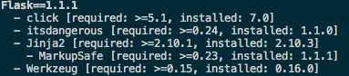

I've written previously about [virtual environments](https://billjellesmacoding.netlify.com/the-virtual-environment-and-you) but rather than update that post on `virtualenv`, I wanted to write a new post on an alternative way to create virtual environments: `pipenv`. After learning about `pipenv` from a friend, I decided to give it a try and it is now my tool of choice. Specifically, I needed to convert my project from using `virtualenv` to `pipenv`.

# The Conversion

0. To get up and running with pipenv, you're going to want to download and install pipenv using `pip install pipenv`.

1. Commit all of your packages to requirements.txt. Pipenv uses a `pipfile` rather than the classic `requirements.txt` which more closely mirrors a `package.json` if you've ever used NodeJS. Whereas the `requirements.txt` is simply a text file with the packages and versions, a `pipfile` seperates dependancies into production and development packages. The advantage of seperating packages into production and development is that users don't need to download every package just to run the code whereas other contributing developers may want all of the dependancies so that they can work on the code. To commit all of the packages in your environment, use `pip freeze > requirements.txt`.

2. Create your new virtual environment with `pipenv shell`. Normally, this command is used to entered a virtual shell prompt; however, if this is the first time that pipenv is being run, it will create the virtual environment in addition to launching you into a new shell prompt.

One confusing caveat here is that using this on mac/linux will give you a nice new prompt to let you know that you're in the virtual enviroment

You can exit the prompt with the simple `exit` command.

However, I first tested this on git bash for windows which did not give me a prompt that looked different. I was only able to tell that I was in the virtual environment by using `pip list`.

2. Install dependencies from requirements.txt. When you run `pipenv install`, pipenv will look for a `pipfile` if it doesn't see one, it will create it; if it sees a `requirements.txt` file, it will be created from that.

if you've updated your requirements.txt file (like I did), you can simply delete both the pipfile and pipfile.lock to recreate them 

To install packages from now on, we can use `pipenv install <package_name>`. If you'd like to install a dev only package, you can do `pipenv install -dev <package_name>`

By Default, pipenv only installs packages listed under `[packages]` when doing `pipenv install` (notice no package is specified). If you have packages installed under `[dev_packages]` such as pytest that you want any developer to use, you would do `pipenv install -dev`. The latter command will install both `[packages]` and `[dev-packages]`.

3. Modify your main commands. Here's where pipenv starts to differ in the way that you use it. Virtualenv requires you to activate the virtual environment before running any of your code. Typically, what I used to do was to have a shell script to activate this virtual environment so that I would do `source env.sh` and then run `python main.py` (Assuming main is the name of my python script and env is the name of my shell script to activate my environment). When I would want to work on another project, I would do `deactivate` to leave my virtual environment. With pipenv, all of this is simplified with one command to activate, run my code, and then deactivate my environment: `pipenv run python main.py`

# Tips

Just like `pip list`, we can see all of our packages with `pipenv graph`. The advantage of `pipenv graph` here is that we can quicly and easily see packages that are dependencies in a tree structure.

Problems

One problem that I ran into is that my env file often has a json like syntax in it, I simply open the command pallet with vscode and use Join lines
https://github.com/theskumar/python-dotenv/issues/82